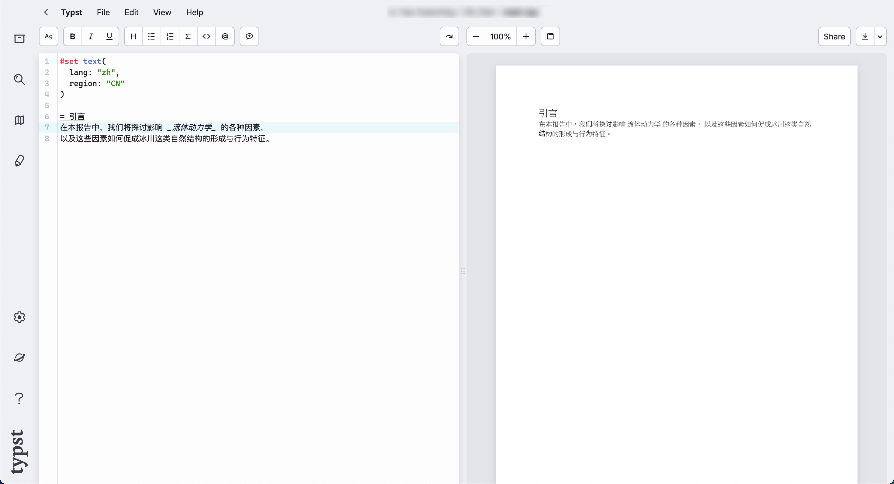
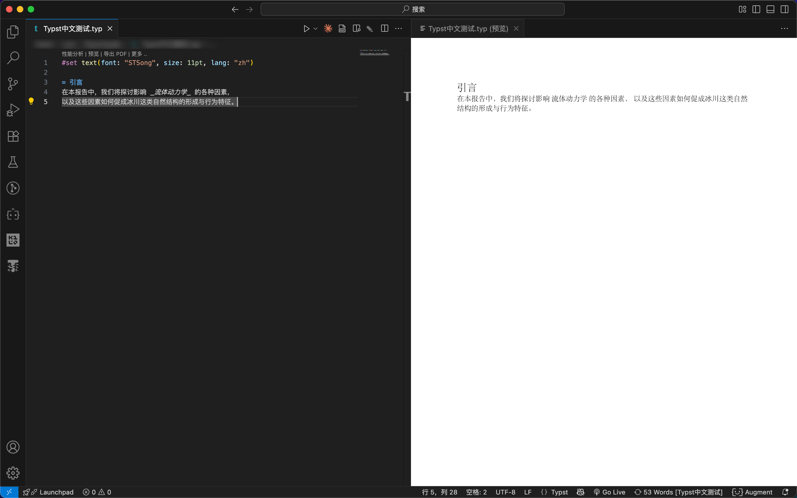

让我们聊聊如何在 Typst 中优雅的使用中文

现阶段，Typst 官方在线编辑器对中文的支持一言难尽，如下图所示，其虽然支持显示中文，但这并非原生中文字体，而是强行渲染出的中文字符



目前在线编辑器并没有内置的中文字体，因此如果你想要获得正常的中文字符显示效果，则必须要**本地安装 Typst**

最推荐也是最简单的方式就是在 VS Code 中安装插件，你可以在[安装 Typst](/tutorial/installing-typst/#vs-code-推荐) 中找到安装方法

当你安装好后，可以尝试将页面字体改为华文宋体 (STSong) 来测试一下效果，只需要在文字前添加一行，输入

```typst
#set text(font: "STSong", lang: "zh")
```

即可

效果如图



这样，我们就可以在 Typst 中优雅地使用中文了！

---

## 查看可用的字体

对于在 VS Code 中安装插件的用户，你可以参照下图，在插件中查看可用字体


对于安装了 Typst CLI 的用户，可以输入命令

```bash
typst fonts
```

来查看所有可用字体