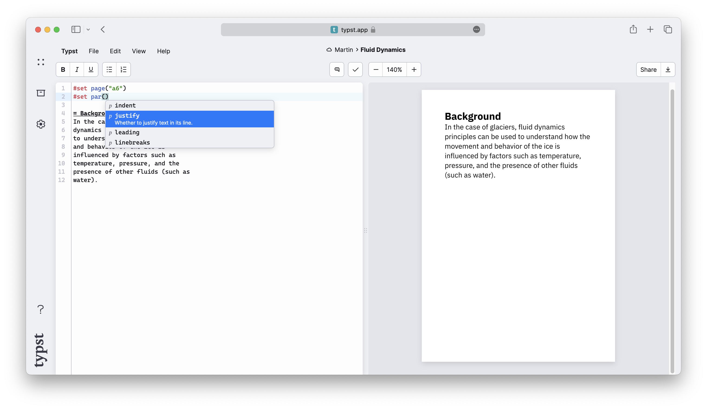

到目前为止，你已经用一些文本、几个公式和图片撰写了一篇报告。然而，它看起来仍然非常朴素。你的助教还不知道你正在使用一种新的排版系统，而你希望你的报告能与其他同学的作业保持一致。在本章中，我们将学习如何使用 Typst 的样式系统来格式化你的报告。

## 设置规则
正如我们在上一章中看到的那样，Typst 有两类函数：一类是 _插入_ 内容的函数（例如 [`image`] 函数），另一类是 _处理_ 作为参数传入的内容的函数（例如 [`align`] 函数）。当你想更改字体时，你可能首先想到的是寻找一个能实现该功能的函数，并将整个文档包裹在其中。

```typ
#text(font: "New Computer Modern")[
  = Background
  In the case of glaciers, fluid
  dynamics principles can be used
  to understand how the movement
  and behaviour of the ice is
  influenced by factors such as
  temperature, pressure, and the
  presence of other fluids (such as
  water).
]
```

等等，函数的所有参数不是都应该写在括号里吗？为什么在括号之后还有一个带内容的方括号？  
答案是：因为在 Typst 中，向函数传递内容是非常常见的操作，因此提供了一种特殊语法：你可以把内容写在普通参数之后的一对方括号中，而不是放在参数列表内部，从而减少标点符号的使用。

如上所示，这样是可行的。通过 [`text`] 函数，我们可以调整其内部所有文本的字体。但若将整个文档包裹在无数个函数中，并逐处手动应用样式，很快就会变得繁琐不堪。

幸运的是，Typst 提供了更优雅的解决方案。通过 **设置规则**，你可以为某种类型的所有内容实例统一应用样式属性。设置规则的写法是输入 `{set}` 关键字，后跟你想设置其属性的函数名称，再跟上括号中的参数列表。

```typ
#set text(
  font: "New Computer Modern"
)

= Background
In the case of glaciers, fluid
dynamics principles can be used
to understand how the movement
and behaviour of the ice is
influenced by factors such as
temperature, pressure, and the
presence of other fluids (such as
water).
```

<div class="info-box">

想从技术角度更深入地了解发生了什么吗？

可以将“设置规则”理解为：为某个函数的部分参数设定默认值，这些值将在后续所有对该函数的调用中生效。
</div>

## 自动补全面板
如果你跟着教程尝试了一些操作，可能会注意到：每次输入 `#` 字符后，都会弹出一个面板，显示可用的函数；而在参数列表中时，则会显示可用的参数。这就是自动补全面板。它在编写文档时非常有用：你可以按回车键选择建议项，或用方向键导航到目标补全项。按 Esc 键可关闭面板，再次输入 `#` 或按下 <kbd>Ctrl</kbd> + <kbd>Space</kbd> 可重新打开。利用自动补全面板，你可以发现函数所需的正确参数。大多数建议都附带简短的功能说明。



## 页面设置
回到设置规则：编写规则时，你需要根据想要样式化的元素类型选择对应的函数。以下是一些常用于设置规则的函数：

- [`text`]：设置文本的字体族、大小、颜色等属性  
- [`page`]：设置页面尺寸、边距、页眉、启用多栏布局和页脚  
- [`par`]：设置段落对齐方式、行间距等  
- [`heading`]：设置标题外观并启用编号  
- [`document`]：设置 PDF 输出中的元数据，如标题和作者  

并非所有函数参数都可以被“设置”。通常，只有控制函数“如何做”的参数可以被设置，而控制“对什么做”的参数则不行。函数参考页面会标明哪些参数是可设置的。

让我们为文档添加更多样式。我们希望有更大的边距和衬线字体。为了示例需要，我们还将设置另一个页面尺寸。

```typ
#set page(
  paper: "a6",
  margin: (x: 1.8cm, y: 1.5cm),
)
#set text(
  font: "New Computer Modern",
  size: 10pt
)
#set par(
  justify: true,
  leading: 0.52em,
)

= Introduction
In this report, we will explore the
various factors that influence fluid
dynamics in glaciers and how they
contribute to the formation and
behaviour of these natural structures.

>>> Glacier displacement is influenced
>>> by a number of factors, including
>>> + The climate
>>> + The topography
>>> + The geology
>>>
>>> This report will present a physical
>>> model of glacier displacement and
>>> dynamics, and will explore the
>>> influence of these factors on the
>>> movement of large bodies of ice.
<<< ...

#align(center + bottom)[
  #image("glacier.jpg", width: 70%)

  *Glaciers form an important
  part of the earth's climate
  system.*
]
```

这里有几个值得注意的地方。

首先是 [`page`] 设置规则。它接收两个参数：页面尺寸和边距。页面尺寸是一个字符串。Typst 支持[许多标准页面尺寸]($page.paper)，但你也可以指定自定义尺寸。边距通过[字典]($dictionary)指定。字典是一组键值对。此处键为 `x` 和 `y`，分别对应水平和垂直边距。你也可以通过传入包含 `{left}`、`right`、`top`、`bottom` 键的字典来分别设置每一边的边距。

接下来是 [`text`] 设置规则。我们设置了字体大小为 `{10pt}`，字体族为 `{"New Computer Modern"}`。Typst 应用程序自带多种字体供你尝试。当你处于文本函数的参数列表中时，可以通过自动补全面板查看可用字体。

我们还设置了行间距（即“行距”），以[长度]值表示，并使用 `em` 单位使行距相对于字体大小：`{1em}` 等于当前字体大小（默认为 `{11pt}`）。

最后，我们通过在居中对齐的基础上增加垂直对齐，实现了图片的底部对齐。水平和垂直对齐可以通过 `{+}` 操作符组合成二维对齐。

## 一点精致感
为了更清晰地组织文档结构，我们现在希望为标题添加编号。这可以通过设置 [`heading`] 函数的 `numbering` 参数实现。

```typ
>>> #set text(font: "New Computer Modern")
#set heading(numbering: "1.")

= Introduction
#lorem(10)

== Background
#lorem(12)

== Methods
#lorem(15)
```

我们将字符串 `{"1."}` 作为编号参数。这告诉 Typst 使用阿拉伯数字为标题编号，并在每一级编号后加一个点。我们还可以使用[字母、罗马数字和符号]($numbering) 来编号标题：

```typ
>>> #set text(font: "New Computer Modern")
#set heading(numbering: "1.a")

= Introduction
#lorem(10)

== Background
#lorem(12)

== Methods
#lorem(15)
```

此示例还使用了 [`lorem`] 函数生成占位文本。该函数接受一个数字作为参数，生成相应数量的 _Lorem Ipsum_ 文本。

<div class="info-box">

你是否好奇：为什么即使没有显式调用 `text` 或 `heading` 函数，设置规则仍能作用于所有文本和标题？

实际上，当你写下 `[= 结论]` 时，Typst 内部会自动调用 `heading` 函数。换句话说，`[#heading[结论]]` 与上面的标题标记完全等价。其他标记元素也是如此，它们只是对应函数调用的“语法糖”。
</div>

## 显示规则
你现在对结果已经相当满意了。但还有一件事需要修正：你正在撰写的这份报告属于一个更大的项目，该项目名称在正文中出现时应始终伴随其标志（logo）。

你考虑了几种方案。你可以使用查找替换功能，在每个“ArtosFlow”前插入 `[#image("logo.svg")]`。但这听起来非常繁琐。或者，你可以[定义一个自定义函数]($function/#defining-functions)，使其始终返回带图片的 logo。不过，还有更简便的方法：

通过 **显示规则**，你可以重新定义 Typst 显示某些元素的方式。你可以指定哪些元素应以不同方式显示，以及它们应该如何呈现。显示规则可用于文本实例、多种函数，甚至整个文档。

```typ
#show "ArtosFlow": name => box[
  #box(image(
    "logo.svg",
    height: 0.7em,
  ))
  #name
]

This report is embedded in the
ArtosFlow project. ArtosFlow is a
project of the Artos Institute.
```

这个例子中出现了许多新语法：我们使用 `{show}` 关键字，后跟希望特殊显示的文本字符串，再跟一个冒号。然后定义一个函数，接收待显示的内容作为参数。这里我们将参数命名为 `name`。现在可以在函数体中使用 `name` 变量打印“ArtosFlow”名称。我们的显示规则在名称前添加了 logo 图像，并将整体放入一个 box 中，防止 logo 与名称之间发生换行。图像本身也被放入 box 中，以避免其单独成段。

第一个 `box` 函数和 `image` 函数调用前没有加 `#`，是因为它们未直接嵌入标记（markup）中。当 Typst 期望代码而非标记时（如参数列表、函数定义和[代码块]($scripting)），无需前导 `#` 即可访问函数、关键字和变量。

## 回顾
你现在已掌握了如何为 Typst 文档应用基本格式化。你学会了如何使用设置规则来设置字体、段落对齐、修改页面尺寸，以及为标题添加编号。你还学会了如何使用基本的显示规则来改变文档中特定文本的呈现方式。

你已提交了报告。你的导师非常喜欢这份报告，甚至想将其改编为一篇会议论文！在下一节中，我们将学习如何使用更高级的显示规则和函数，将文档格式化为学术论文。