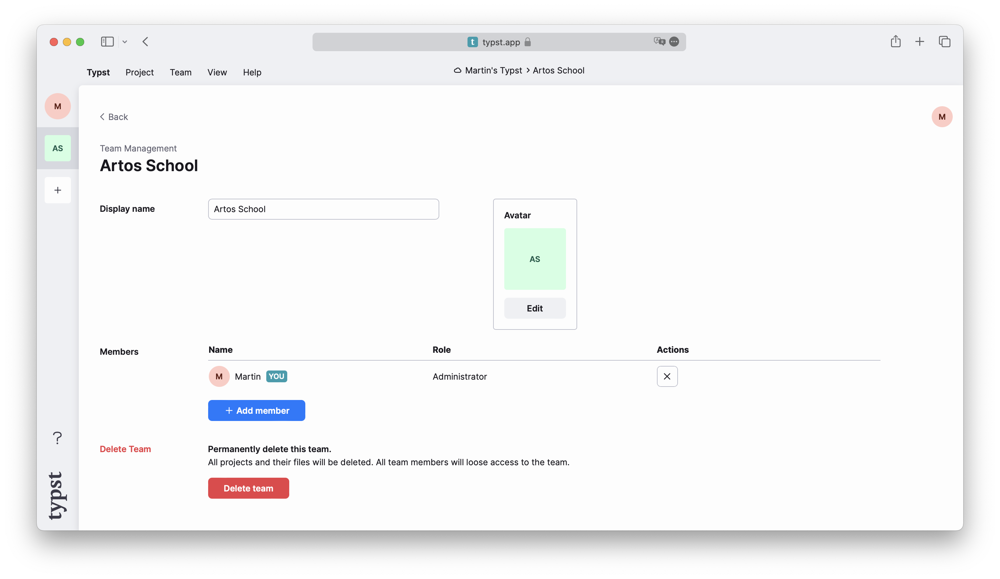

在本教程的前两章中，你已经学会了如何用 Typst 编写文档以及如何更改其格式。你在前两章中撰写的报告获得了满分，你的导师希望在此基础上撰写一篇会议论文！当然，这篇论文必须符合会议的格式要求。让我们看看如何实现这一点。

在开始之前，先创建一个团队，邀请你的导师并将其加入团队。你可以通过点击编辑器左上角的返回图标回到应用仪表板，然后在左侧工具栏中选择加号图标来创建团队。最后，点击新创建的团队，通过点击团队名称旁边的 “管理团队” 进入设置页面，即可通过电子邮件邀请你的导师。



接下来，将你的项目移入该团队：打开项目，点击左侧工具栏的齿轮图标进入设置，然后从所有者下拉菜单中选择你新建的团队。别忘了保存更改！

现在，你的导师也可以编辑该项目，并且你们可以实时看到彼此的修改。你还可以加入我们的 [Discord 服务器](https://discord.gg/2uDybryKPe) 寻找其他用户，尝试与他们共同使用团队功能！

## 会议格式要求

会议的排版规范可以在其官网上找到。我们来看一下具体要求：

- 正文字体应为 11pt 的衬线字体
- 标题应为 17pt 且加粗
- 论文包含一个单栏摘要和双栏正文
- 摘要内容应居中显示
- 正文应设置为两端对齐
- 一级标题应为 13pt、居中，并以小型大写字母（small caps）呈现
- 二级标题为段内标题（run-in），斜体，字号与正文相同
- 页面尺寸为美国信纸（US letter），页码位于页脚中央，每页右上角需显示论文标题

我们已经知道如何实现其中的许多要求，但有些功能还需要学习一些新技巧。

## 编写正确的设置规则

让我们先为文档编写一些设置规则。

```typ
#set page (
  paper: "us-letter",
  header: align (right)[
    A fluid dynamic model for
    glacier flow
  ],
  numbering: "1",
)
#set par (justify: true)
#set text (
  font: "Libertinus Serif",
  size: 11pt,
)

#lorem (600)
```

你对这里的大多数内容已经很熟悉了。我们将字体大小设为 `{11pt}`，字体设为 Libertinus Serif，启用段落两端对齐，并将页面尺寸设为美国信纸。

`header` 参数是新的：它允许我们为每页顶部边距添加内容。我们使用 `align` 函数将论文标题靠右对齐，符合会议格式要求。

最后是 `numbering` 参数：我们可以在此提供一个 [编号模式]($numbering)，用于定义页码的显示方式。设置为 `{"1"}` 时，Typst 只显示简单的页码；若设为 `{"(1/1)"}`，则会显示 “当前页 / 总页数” 并用括号包围。甚至可以在此处提供自定义函数，以实现个性化格式。

## 创建标题和摘要

现在，我们来添加标题和摘要。先从标题开始。我们将其居中对齐，并通过 `[* 加粗星号 *]` 语法使其加粗。

```typ
#align (center, text (17pt)[
  *A fluid dynamic model
  for glacier flow*
])
```

效果正确。我们使用 `text` 函数局部覆盖之前的文本设置，将标题字体大小临时设为 17pt。接下来添加作者列表：由于我们与导师共同撰写，因此要添加两人的姓名。

```typ
#grid (
  columns: (1fr, 1fr),
  align (center)[
    Therese Tungsten \
    Artos Institute \
    #link ("mailto:tung@artos.edu")
  ],
  align (center)[
    Dr. John Doe \
    Artos Institute \
    #link ("mailto:doe@artos.edu")
  ]
)
```

两个作者信息块并排显示。我们使用 [`grid`] 函数创建此布局。通过 grid，我们可以精确控制每列的大小以及内容的分布。`columns` 参数接受一个 [相对长度]($relative) 或 [分数]($fraction) 数组。此处我们传入两个相等的分数值，使可用空间均分为两列。接着向 grid 函数传入两个内容参数：第一个是我们自己的信息，第二个是导师的信息。我们再次使用 `align` 函数在列内居中内容。grid 支持任意数量的内容参数，行会自动添加，也可以通过 `rows` 参数手动设置行高。

现在添加摘要。记住会议要求摘要为居中且非两端对齐。

```typ
...

#align (center)[
  #set par (justify: false)
  *Abstract* \
  #lorem (80)
]
```

做得很好！值得注意的是，我们在 `align` 的内容参数中使用了一个 set 规则来关闭摘要的两端对齐。由于内容块具有样式作用域（_scope_ styling），这种设置不会影响文档其余部分，即使它出现在之前的 set 规则之后。

另一个优化是将论文标题保存为变量，避免在页眉和标题中重复输入。我们可以使用 `{let}` 关键字实现：

```typ
#let title = [
  A fluid dynamic model
  for glacier flow
]

...

#set page (
  header: align (
    right + horizon,
    title
  ),
  ...
)

#align (center, text (17pt)[
  *#title*
])

...

```

将内容绑定到 `title` 变量后，我们可以在函数和标记中使用它（像函数一样以 `#` 前缀调用）。这样，如果需要更改标题，只需在一个地方修改即可。

## 添加分栏和标题

上面的论文看起来像一堵文字墙。为解决这个问题，我们来添加一些标题并将论文改为双栏布局。幸运的是，这很容易实现：只需在 `page` 设置规则中添加 `columns` 参数。

通过添加 `{columns: 2}`，我们将整个文档包裹在双栏中。但这也会使标题和作者信息跨栏显示。为保持它们横跨整页，我们可以将它们包裹在 [`{place}`]($place) 函数调用中。`place` 函数接受对齐方式和内容作为位置参数。通过命名参数 `{scope}`，我们可以决定内容是相对于当前栏还是其父级（页面）定位。还有一个配置项：如果没有其他参数，`{place}` 会将内容从文档流中移出，使其覆盖其他内容而不影响容器内其他内容的布局：

```typ
#place (
  top + center,
  rect (fill: black),
)
#lorem (30)
```

如果这里没有使用 `{place}`，正方形会独占一行，但在此它与后面的几行文字重叠。同时，这些文字表现得好像没有正方形存在。要改变这种行为，可以传入参数 `{float: true}`，确保放置项在页面顶部或底部占用的空间不会被其他内容占据。

```typ
#set page (
  paper: "us-letter",
  header: align (
    right + horizon,
    title
  ),
  numbering: "1",
  columns: 2,
)

#place (
  top + center,
  float: true,
  scope: "parent",
  clearance: 2em,
)[
  ...

  #par (justify: false)[
    *Abstract* \
    #lorem (80)
  ]
]

= Introduction
#lorem (300)

= Related Work
#lorem (200)
```

在此示例中，我们还使用了 `{place}` 函数的 `clearance` 参数，以提供放置项与正文之间的间距，而无需使用 [`{v}`]($v) 函数。由于内容继承了放置时的居中对齐，我们也可以移除各部分显式的 `{align (center, ..)}` 调用。

现在只剩最后一件事：样式化我们的标题。我们需要让它们居中并使用小型大写字母。由于 `heading` 函数本身不支持这些设置，我们必须编写自己的标题显示规则。

```typ
#show heading: it => [
  #set align (center)
  #set text (13pt, weight: "regular")
  #block (smallcaps (it.body))
]

...
```
效果很好！我们使用了一个适用于所有标题的显示规则。该规则接收标题作为参数，该参数可用作内容，也包含 `title`、`numbers` 和 `level` 等字段，可用于自定义外观。我们在这里居中对齐，将字体粗细设为 `"regular"`（因为标题默认加粗），并使用 [`smallcaps`] 函数以小型大写字母渲染标题。

唯一剩下的问题是所有标题现在看起来都一样。“Motivation” 和 “Problem Statement” 等子节标题应为斜体段内标题，但目前它们与节标题无法区分。我们可以通过在设置规则上使用 `where` 选择器来解决这个问题：这是我们可以调用的一种 [方法]($scripting/#methods)，用于根据标题级别过滤它们。我们可以用它来区分节标题和子节标题：

```typ
#show heading.where (
  level: 1
): it => block (width: 100%)[
  #set align (center)
  #set text (13pt, weight: "regular")
  #smallcaps (it.body)
]

#show heading.where (
  level: 2
): it => text (
  size: 11pt,
  weight: "regular",
  style: "italic",
  it.body + [.],
)
```

现在看起来很棒！我们编写了两个分别应用于一级和二级标题的显示规则。我们使用 `where` 选择器根据标题级别进行过滤。我们将子节标题渲染为段内标题，并自动在末尾添加句号。

让我们回顾一下会议的格式要求：
- 正文字体为 11pt 衬线字体 ✓
- 标题为 17pt 且加粗 ✓
- 论文包含单栏摘要和双栏正文 ✓
- 摘要居中显示 ✓
- 正文两端对齐 ✓
- 一级标题居中、小型大写字母、13pt ✓
- 二级标题为段内、斜体、字号与正文相同 ✓
- 页面为美国信纸尺寸，页码居中，每页右上角显示论文标题 ✓

现在我们已完全符合所有格式要求，可以向会议提交论文了！最终论文效果如下：


## 回顾

你现在学会了：
- 如何创建页眉和页脚
- 如何使用函数和作用域局部覆盖样式
- 如何使用 [`grid`] 函数创建复杂布局
- 如何为特定函数或整个文档编写显示规则
- 如何使用 [`where` 选择器]($styling/#show-rules) 按级别筛选标题

这篇论文大获成功！你在会议上结识了许多志同道合的研究者，并计划明年在同一会议发表新项目。不过，你仍需使用相同的格式指南撰写新论文，也许现在可以为团队创建一个省时的模板？

在下一节中，我们将学习如何创建可在多个文档中复用的模板。这是一个更高级的主题，如果你现在觉得有难度，可以稍后再回来学习。