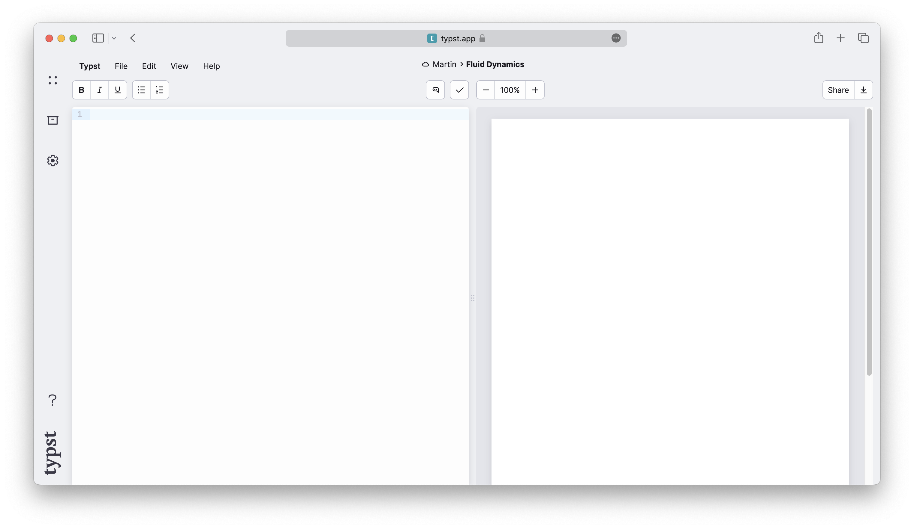
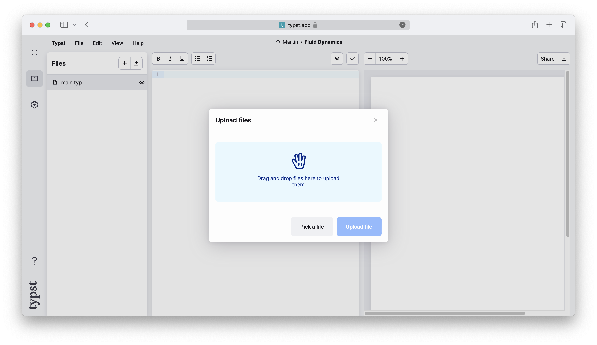

让我们开始吧！假设你被分配了一项任务：为大学撰写一份技术报告。这份报告将包含正文、数学公式、标题和图表。为了开始，你在 Typst 应用程序中创建一个新项目。你会进入编辑器界面，看到两个面板：左侧是**源码面板**，你在这里编写文档内容；右侧是**预览面板**，用于实时查看渲染后的文档效果。



你已经对报告的写作角度有了清晰的想法。现在先从撰写引言部分开始。在编辑器中输入一些文本，你会立即在预览页面上看到对应的内容显示出来。

```typst
In this report, we will explore the
various factors that influence fluid
dynamics in glaciers and how they
contribute to the formation and
behaviour of these natural structures.
```

_在整个教程中，我们会像这样展示代码示例。就像在应用程序中一样，第一个面板显示标记语言 (markup)，第二个面板展示预览效果。我们缩小了页面尺寸以适应示例，便于你观察实际效果。_

接下来，添加一个标题并强调某些文字。Typst 对最常见的格式化任务使用简单的标记语法。要添加标题，请输入 `=` 字符；若要将文本设为斜体以强调，用 `[_下划线_]` 将其包围。

```typst
= Introduction
In this report, we will explore the
various factors that influence _fluid
dynamics_ in glaciers and how they
contribute to the formation and
behaviour of these natural structures.
```

很简单吧！要添加新的段落，只需在两行文本之间插入一个空行即可。如果该段落需要一个子标题，可以用 `==` 替代 `=` 来创建。`=` 的数量决定了标题的层级结构。

现在我们希望列出一些影响冰川动力学的因素。为此，使用编号列表。每个列表项前加一个 `+` 字符，Typst 会自动为项目编号。

```typst
+ The climate
+ The topography
+ The geology
```

如果你想添加项目符号列表 (即无序列表)，可以使用 `-` 字符代替 `+`。还可以嵌套列表：例如，通过缩进方式为上面列表的第一个项目添加子列表。

```typst
+ The climate
  - Temperature
  - Precipitation
+ The topography
+ The geology
```

## 添加图表

你认为报告中加入一张图表会更有说服力。现在来添加它。Typst 支持 PNG、JPEG、GIF、SVG 和 WebP 格式的图像。要将图像文件上传到项目中，请先点击左侧边栏中的方框图标打开**文件面板**。这里列出了项目中的所有文件。目前只有一个文件：你正在编辑的主 Typst 文件。要上传其他文件，请点击右上角的箭头按钮，打开上传对话框，从中选择你的计算机上的图像文件进行上传。



我们之前已经看到，特定符号 (称为 _标记_) 在 Typst 中具有特定含义。我们可以使用 `=`, `-`, `+`, `_` 分别创建标题、列表和强调文本。但如果每个要插入的内容都需要一个特殊符号，很快就会变得复杂且难以管理。因此，Typst 只为最常用的功能保留了这些标记符号。其余内容则通过 _函数_ 插入。

为了让图像出现在页面上，我们将使用 Typst 的 \[`image`] 函数。

```typst
#image("glacier.jpg")
```

通常情况下，函数根据一组 _参数_ 生成输出结果。当你在标记中 _调用_ 一个函数时，提供参数，Typst 会将结果 (即函数的 _返回值_) 插入文档。在此例中，`image` 函数接受一个参数：图像文件的路径。在标记中调用函数时，首先输入 `#` 字符，紧接着是函数名称，然后将参数用括号包围。Typst 能识别参数列表中的多种数据类型。我们的文件路径是一段较短的[文本字符串]($str)，因此需要用双引号括起来。

插入的图像默认占据整个页面宽度。要更改这一点，可以向 `image` 函数传递 `width` 参数。这是一个 _命名参数_，需以 `name: value` 的形式指定。如果有多个参数，需要用逗号分隔，所以我们先在路径后加一个逗号。

```typst
#image("glacier.jpg", width: 70%)
```

`width` 参数是一个[相对长度]($relative)。本例中我们指定了百分比，表示图像应占据页面宽度的 `{70%}`。你也可以使用绝对值，如 `{1cm}` 或 `{0.7in}`。

和文本一样，图像默认靠左对齐。此外，它还没有标题说明。让我们用 \[figure] 函数来解决这个问题。该函数接受图表内容作为位置参数，并可选地接受一个命名参数作为标题。

在 `figure` 函数的参数列表中，Typst 已处于代码模式。这意味着你现在必须去掉 `image` 函数调用前的井号 `#`。`#` 仅在标记中使用 (用于区分普通文本与函数调用)。

标题可以包含任意标记内容。要向函数传递标记内容，需将其用方括号 `[...]` 包裹起来。这种结构称为 _内容块_ (content block)。

```typst
#figure(
  image("glacier.jpg", width: 70%),
  caption: [
    _Glaciers_ form an important part
    of the earth's climate system.
  ],
)
```

你继续撰写报告，并希望引用刚才的图表。为此，首先为图表附加一个标签。标签用于唯一标识文档中的某个元素。在图表后使用尖括号 `<...>` 添加一个标签名称。之后就可以在正文中通过 `[@]` 加上标签名来引用它。标题和公式也可以被打上标签以便引用。

```typst
Glaciers as the one shown in
@glaciers will cease to exist if
we don't take action soon!

#figure(
  image("glacier.jpg", width: 70%),
  caption: [
    _Glaciers_ form an important part
    of the earth's climate system.
  ],
) <glaciers>
```

:::tip[INFO]

到目前为止，我们已经向函数传递了内容块 (用方括号包裹的标记) 和字符串 (用双引号包裹的文本)。两者似乎都包含文本，有什么区别？

内容块可以包含文本、其他标记、函数调用等多种内容，而字符串仅仅是 _字符序列_，不含任何结构或语义。

例如，`image` 函数期望的是图像文件的路径，不可能接受一段段落文本或另一个图像作为路径参数。因此这里只允许字符串。相反，字符串可以在任何期望内容的地方使用，因为纯文本本身就是一种有效的内容形式。

:::

## 添加参考文献

在撰写报告的过程中，你需要为一些论点提供文献支持。可以使用 \[`bibliography`] 函数向文档添加参考文献列表。该函数需要一个指向参考文献文件的路径。

Typst 原生支持的参考文献格式是 [Hayagriva](https://github.com/typst/hayagriva/blob/main/docs/file-format.md)，但为了兼容性，也支持 BibLaTeX 文件 (`.bib` 格式)。由于你的同学已经完成了一项文献调研并发送给你一个 `.bib` 文件，你可以直接使用它。通过文件面板上传该文件，即可在 Typst 中访问。

一旦文档中包含了参考文献，你就可以开始从中引用条目。引用语法与标签引用相同。当你首次引用某个文献来源时，它将自动出现在文档末尾的参考文献部分。Typst 支持多种引用和参考文献样式。详情请参阅[参考文档]($bibliography.style)。

```typst
= Methods
We follow the glacier melting models
established in @glacier-melt.

#bibliography("works.bib")
```

## 数学公式

完成方法部分后，你进入文档的核心部分：数学公式。Typst 内置了强大的数学排版功能，并采用自己独特的数学表达语法。先从一个简单公式开始。使用 `[$]` 符号将其包围，告诉 Typst 这是一个数学表达式：

```typst
The equation $Q = rho A v + C$
defines the glacial flow rate.
```

该公式以行内形式排版，与周围文本在同一行。如果你想让它单独成行显示，只需在公式前后各加一个空格：

```typst
The flow rate of a glacier is
defined by the following equation:

$ Q = rho A v + C $
```

可以看到，Typst 将单个字母 `Q`, `A`, `v`, `C` 原样显示，而将 `rho` 转换为希腊字母 ρ。在数学模式下，单个字母总是原样显示；多个字母则被解释为符号、变量或函数名。若要在单个字母间表示乘法关系，可在它们之间加入空格。

如果你想创建一个多字母组成的变量名，可以将其用引号括起来：

```typst
The flow rate of a glacier is given
by the following equation:

$ Q = rho A v + "time offset" $
```

你的论文还需要一个求和公式。可以使用 `sum` 符号，并通过上下标指定求和范围：

```typst
Total displaced soil by glacial flow:

$ 7.32 beta +
  sum_(i=0)^nabla Q_i / 2 $
```

要为符号或变量添加下标，使用 `_` 字符；添加上标则使用 `^` 字符。如果下标或上标包含多个元素，则必须用圆括号 `(...)` 包裹。

上述例子还展示了如何插入分数：只需在分子和分母之间使用 `/` 字符，Typst 会自动将其转换为分数形式。括号会被智能解析，你可以像在计算器中那样输入表达式，Typst 会自动将括号内的子表达式转换为适当的数学符号。

```typst
Total displaced soil by glacial flow:

$ 7.32 beta +
  sum_(i=0)^nabla
    (Q_i (a_i - epsilon)) / 2 $
```

并非所有数学结构都有特殊语法。此时我们仍使用函数，就像之前使用的 `image` 函数一样。例如，插入列向量可以使用 [`vec`]($math.vec) 函数。在数学模式中，函数调用不需要以 `#` 开头。

```typst
$ v := vec(x_1, x_2, x_3) $
```

有些函数仅在数学模式中可用。例如，[`cal`]($math.cal) 函数用于排版常用于集合的花体字母。[参考文档的数学部分]($category/math) 提供了数学模式下所有可用函数的完整列表。

还有一点：许多符号 (如箭头) 有多种变体。你可以通过在符号名后加上点和修饰符名称来选择不同样式：

```typst
$ a arrow.squiggly b $
```

这种语法在标记模式中也可使用，但符号名前必须加上 `#sym.`。详见[符号部分]($category/symbols/sym) 获取所有可用符号的列表。

## 回顾

你现在已了解如何使用 Typst 编写基本文档。你学会了如何强调文本、编写列表、插入图像、对齐内容以及排版数学表达式。你还了解了 Typst 的函数机制。Typst 还支持更多类型的元素插入，例如 [表格]($table)、[图形]($category/visualize) 和 [代码块]($raw)。你可以浏览 \[参考文档] 了解更多功能。

目前，你已完成报告的撰写。你已经通过点击右上角的下载按钮保存了 PDF 文件。不过你觉得报告看起来还有些单调。在下一节中，我们将学习如何自定义文档的外观。